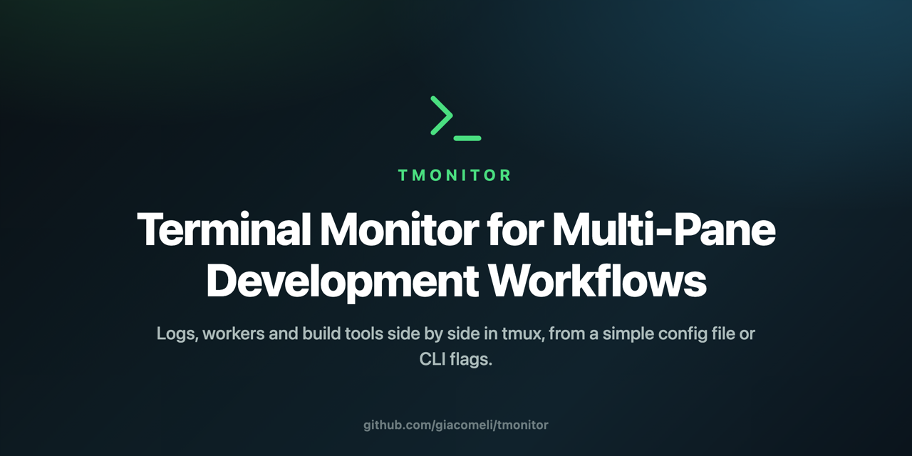
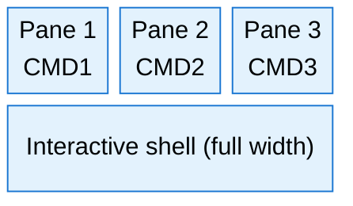
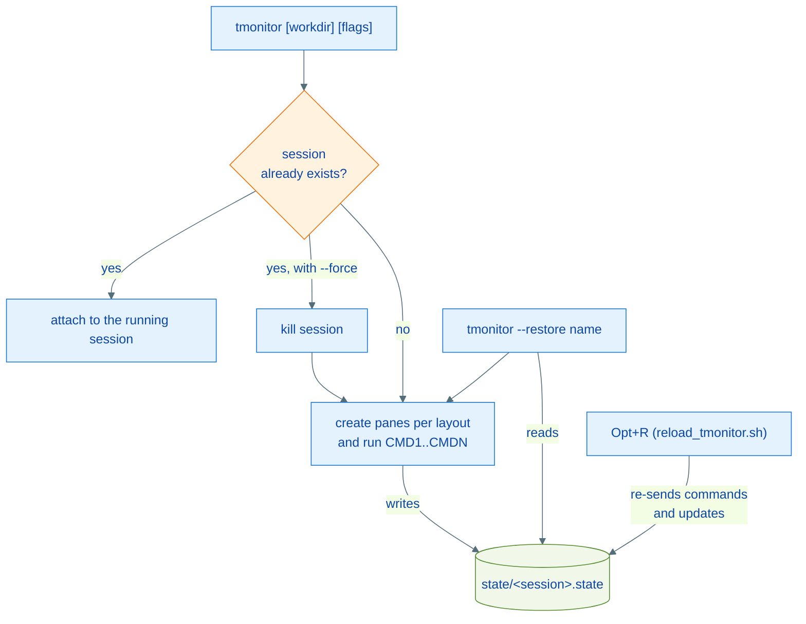

# TMonitor - Terminal Monitor for Multi-Pane Development Workflows

<p align="center">
  
</p>

<p align="center">
  <a href="LICENSE"></a>
  
  
</p>

TMonitor is a lightweight, shell-based tmux session manager for terminal monitoring dashboards. It creates a session with any number of command panes plus a free interactive shell — from a simple config file, from command-line flags, or both — perfect for managing logs, workers, build tools, and SSH-based workflows.

## Motivation

In nearly every development scenario — web apps, CLI tools, APIs, background jobs — we constantly perform repetitive terminal tasks:

- Tailing logs
- Restarting queues or workers
- Running build tools (e.g., `npm`, `vite`, `php artisan`, `composer`)
- Navigating into project directories and managing subprocesses

Doing this manually every time eats up focus and time. TMonitor automates this routine with a single command.

It is also useful for managing remote SSH-based workflows: quickly spin up sessions on remote servers to monitor logs, debug services, or handle long-running workers — all within a structured `tmux` layout.

## Features

- Any number of command panes (`CMD1..CMDN`) plus an interactive shell pinned to the bottom
- Three layouts for the command area: `columns` (default), `rows` and `grid`
- Optional labels on each pane border (`LABEL1..LABELN`)
- CPU, memory and disk stats in the status bar (`STATS=on|off`)
- Session snapshots and recovery: re-running `tmonitor` attaches to a live session, and `--restore` rebuilds a session after a reboot or `tmux kill-server`
- Ad-hoc / agent mode: build a session entirely from CLI flags (`--pane-1="..."`), no config file needed
- Reload commands in place with `Opt+R`; quit safely with `Opt+Q`
- All appearance settings are scoped to the TMonitor session — your other tmux sessions are left untouched

Default layout (`columns`), here with 3 commands:



With `rows` the command panes stack vertically; with `grid` they spread over a balanced grid, filled column by column. The interactive shell always stays at the bottom, full width, with its height controlled by `SHELL_HEIGHT`.

## Tested On

- macOS Sequoia
- tmux 3.5a

## Installation

1. Clone or move the three scripts to a permanent directory (recommended: `~/.tmux/scripts/`). They must stay in the same directory — `tmonitor.sh` locates `reload_tmonitor.sh` and `tmonitor_stats.sh` relative to itself:

   ```text
   ~/.tmux/scripts/
     tmonitor.sh           # creates the session
     reload_tmonitor.sh    # reloads commands in a running session (Opt+R)
     tmonitor_stats.sh     # CPU/MEM/DISK line for the status bar
   ```

2. Make them executable:

   ```bash
   chmod +x ~/.tmux/scripts/tmonitor.sh ~/.tmux/scripts/reload_tmonitor.sh ~/.tmux/scripts/tmonitor_stats.sh
   ```

3. Add this alias to your shell config (`.zshrc`, `.bashrc`, etc):

   ```bash
   alias tmonitor='~/.tmux/scripts/tmonitor.sh "$PWD"'
   ```

4. Reload your shell:

   ```bash
   source ~/.zshrc
   ```

## Configuration

In your project directory, create a `tmonitor.conf` file:

```bash
SESSION_NAME="My Laravel App Monitor"
LAYOUT="columns"

CMD1="tail -f storage/logs/laravel.log"
LABEL1="logs"

CMD2="php artisan queue:work"
LABEL2="queue"

CMD3="npm run dev"

CMD4="php artisan horizon"
LABEL4="horizon"
```

| Variable | Required | Default | Description |
| --- | --- | --- | --- |
| `CMD1..CMDN` | `CMD1` yes | — | Commands for the panes. Numbering must be sequential (discovery stops at the first missing index). |
| `LABEL1..LABELN` | no | truncated command | Label shown on the pane border. |
| `SESSION_NAME` | no | `monitoring` | tmux session name (must not contain `:` or `.`). |
| `LAYOUT` | no | `columns` | `columns`, `rows` or `grid`. |
| `SHELL_HEIGHT` | no | `30` | Height of the interactive shell pane, in percent (10-90). |
| `STATS` | no | `on` | Show CPU/MEM/DISK in the status bar (`on`/`off`). |

## Usage

From your project root (where `tmonitor.conf` exists):

```bash
tmonitor
```

If the session already exists, TMonitor attaches to it instead of recreating it. To throw the session away and rebuild it from the current config, use `--force`.

### Command-line options

```bash
tmonitor.sh [workdir] [options]
```

| Option | Description |
| --- | --- |
| `--pane-N="command"` | Command for pane N (overrides `CMDN`). With at least one `--pane-N`, `tmonitor.conf` becomes optional. |
| `--label-N="text"` | Label for pane N (overrides `LABELN`). |
| `--session="name"` | Session name (overrides `SESSION_NAME`). |
| `--layout=NAME` | `columns`, `rows` or `grid` (overrides `LAYOUT`). |
| `--shell-height=PCT` | Interactive pane height in percent (overrides `SHELL_HEIGHT`). |
| `--detach` | Create the session without attaching to it. |
| `--force` | Kill and recreate the session if it already exists. |
| `--restore [name]` | Recreate a session from its snapshot; without a name, lists available snapshots. |
| `--help` | Show usage. |

CLI flags override the config file key by key: you can keep your `tmonitor.conf` and replace a single pane for one run. Precedence is CLI > `tmonitor.conf` > defaults.

### Ad-hoc / agent mode

Build a session with no config file at all — useful for scripts and AI agents that assemble monitoring sessions on demand:

```bash
tmonitor.sh --session="deploy-watch" \
  --pane-1="kubectl get pods -w" --label-1="pods" \
  --pane-2="stern api" --label-2="api logs" \
  --detach
```

`--detach` creates the session and returns immediately; attach later with `tmux attach -t deploy-watch`.

This repository ships an agent skill at [`skills/tmonitor/`](./skills/tmonitor/) that teaches LLM coding assistants (Claude Code and similar) how to drive TMonitor: always creating sessions detached, labeling panes, picking layouts, and managing reload/restore. In this repo it is already linked at `.claude/skills/tmonitor`; to use it from other projects, copy or symlink the folder into `~/.claude/skills/`.

### Session recovery

Every time a session is created or reloaded, TMonitor writes a snapshot of its resolved state (workdir, commands, labels, layout) to `~/.tmux/tmonitor/state/<session>.state`. After a reboot or `tmux kill-server`:

```bash
tmonitor.sh --restore              # list available snapshots
tmonitor.sh --restore deploy-watch # rebuild the session
```

Recovery recreates the session and re-runs the commands; it does not restore previous pane output (for full scrollback restoration, use tmux-resurrect alongside).



## Hotkeys

Inside the tmux session:

- **Opt + Q**: quit the session (asks for confirmation)
- **Opt + R**: reload the commands from `tmonitor.conf` (without recreating the session)

The bindings are registered globally in the tmux server (tmux has no per-session bindings), but they are guarded: in sessions not created by TMonitor they do nothing.

## Upgrading from the 3-pane version

- `tmonitor` no longer kills an existing session silently — it attaches to it. Use `--force` for the old behavior.
- Existing `tmonitor.conf` files with `CMD1..CMD3` keep working unchanged, with the same visual result.
- The `Opt+R` binding now resolves the reload script from wherever `tmonitor.sh` lives, so reload also works when running straight from a clone.

## Roadmap

- [x] Support for custom layouts (e.g., vertical splits, grid)
- [x] More than 3 command panes with dynamic layout
- [x] Custom labels or titles for panes
- [x] Integration with system stats (CPU, memory, disk)
- [x] Persist pane state and session recovery

## Notes

- Works well for local development and remote SSH sessions.
- Session names are used as snapshot file names: two projects using the same `SESSION_NAME` share (and overwrite) the same snapshot.
- Designed to minimize cognitive load and maximize focus during dev cycles.

## Contributions

Feel free to fork, improve, or submit PRs. Ideas and feedback are always welcome!

## License

MIT — see [LICENSE](LICENSE).
